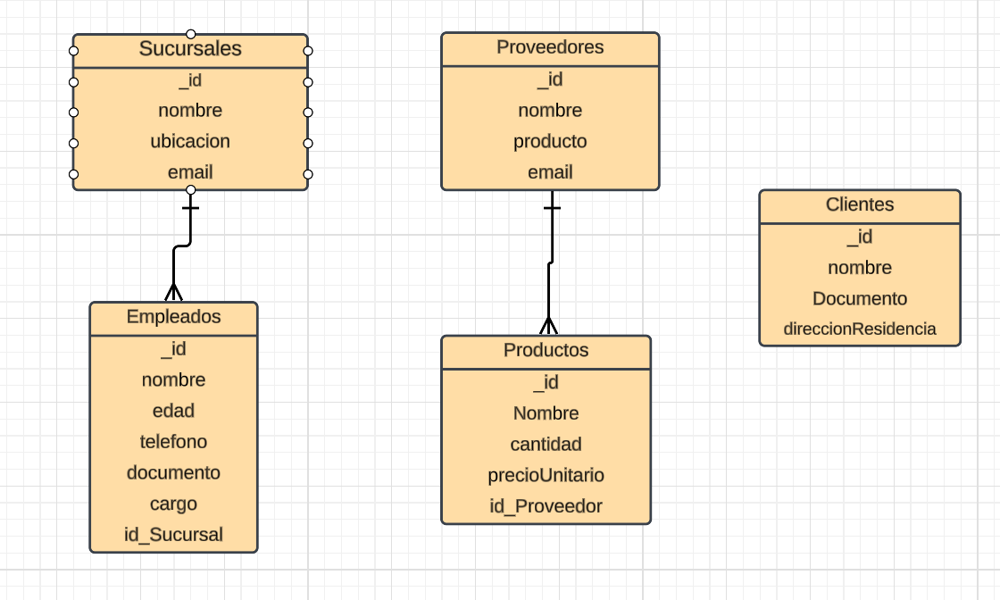
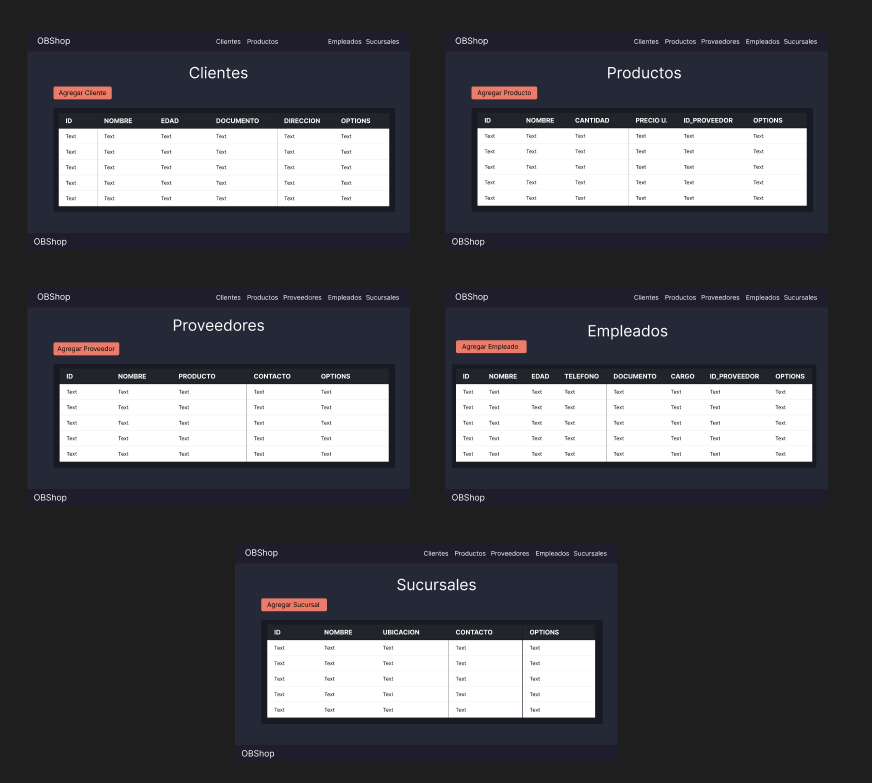

# 🏬 OBShop Apliccacion Web FullStack (Desarrollado con MERN)

**Estea aplicación web esta diseñada para ayudar a gestionar eficazmente los aspectos administrativos de tu empresa. Fue desarrollado utilizando el stack MERN, que incluye MongoDB, Express.js, React y Node.js. Con esta aplicación, puedes gestionar proveedores, productos, empleados, sucursales y clientes de manera conveniente y eficiente.**

 

# 💡 Objetivo

**Se centra en la creación de una herramienta que mejore la eficiencia y la organización en una empresa, facilitando la gestión de múltiples aspectos importantes de la operación empresarial**

 

# 📋 Funcionalidades Principales

- **Gestión de Proveedores: Agrega y elimina proveedores. Registra información detallada de los proveedores, como nombre, contacto y productos suministrados.**

- **Gestión de Productos: Administra tu catálogo de productos. Agrega nuevos productos y elimina productos obsoletos.**

- **Gestión de Empleados: Lleva un registro de tu equipo de trabajo. Agrega nuevos empleados y controla sus roles.**

- **Gestión de Sucursales: Administra las sucursales de tu empresa. Registra ubicaciones y detalles de contacto.**

- **Gestión de Clientes: Lleva un seguimiento de tus clientes. Agrega nuevos clientes y registra su informacion personal.**

 

# 🖇️ Diagrama Entidad Relacion

 

# Tecnologías Utilizadas

  
  
  
  
  
  
  

 

# 🎨 Diseño UIX

 

# 🖋️Autor

**Phidolly Ojeda**
